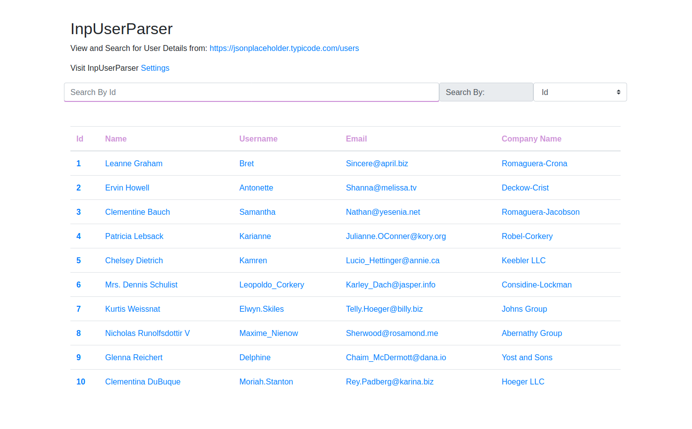

# InpUserParser


### About
>InpUserParser is a lightweight and easy to install Wordpress plugin.
It Offers comprehensive parsing of user data from a specific REST API endpoint : [`https://jsonplaceholder.typicode.com/users`](https://jsonplaceholder.typicode.com/users)
>[](https://github.com/10up/wp_mock/blob/trunk/LICENSE.md)


### Requirements:
To install and get the plugin running. all that is needed is a Wordpress installation and git and composer already installed.
It is also essential that PHP 7+ is available


### Installation:
The Plugin could be installed easily by cloning its repository into any Wordpress installation plugin directory
and then pulling the composer dependencies
to install the plugin, cd into your Wordpress plugin directory as shown

```bash
$ cd <wordpress-core path>/wp-content/plugins
```

when you are in the plugin folder, clone the repo

```bash
$ git clone https://github.com/okerefe/inpuserparser.git
```
and then download the composer dependencies as shown:

```bash
$ composer update
```
This is all you need to get the Wordpress plugin running

### Activation
To activate the plugin. visit the plugins settings page on Wordpress's admin dashboard and you would find the plugin among the listings there: "InpUserParser".
Click on the activation link and after activation, a link to the settings page controlling functionalities of the plugin will appear below the plugin listing. Click on this link to visit the plugins settings page


After installation, the plugins public page can be visited by navigating to the following link: ```http:wordpress.siteurl/?inpuserparser```where wordpress.site is the Wordpress public site URL


### Usage
> Usage of the InpUserParser on the public-facing page

when the plugin page loads. the users from the endpoint are loaded through ajax.
to view more and complete details of any user, click on any of the table entries for that user.

when an entry is clicked, a modal popup appears and shows all the details pertaining to the user.
the reason for loading this details in a modal popup is so it will also work seamlessly on mobile user agents where space is at a premium.

to dismiss the modal, click on the close link at the button right corner or the ```X``` button at the top right corner

##### Search Feature
Searches can also be made on different users using specific parameters. 
this parameter could be their id, name, username, etc.
at the right-hand side of the search bar, there is a select option where you can select what column you wish to use in searching for a user

when you start typing, the search  loads automatically when the search string is 3 characters and above, although for search by Id. just a minimum of 1 character is needed to automatically start the search


### Configuring InpUserParser on settings Page
The InpUserParser Plugin is highly customizable.
from the settings page, one can choose which column one wishes to be available on the public-facing page. although there are some compulsory columns that can't be fashioned out

one can also choose what search parameters can be available on the front-facing page of the plugin and even to disable search entirely.
when this is done, the search bar is no longer loaded on the public-facing side of the plugin


### Implementations and their rationale

##### Search Functionality (reason behind the implementation and its efficiency)
The search functionality was added to ease a user that wishes to search for someone by a range of given parameters. this would help a user to easily navigate and find specific users easily especially if or when the amount of users loading from the external API becomes many.

A different range of parameters that a user can search by is also made available so one can search for a user using any of the user's details that one remembers from the list of the ones provided

though the search function seems great, it has some drawbacks in terms of efficiency in the inner workings. for the search function to work, it has to first load all the data on the server and loop through each of them to get the required one.
this could be made much faster if the search is been done straight on the database to avoid many processes. but we do not have access to this database
although since the request is cached, performance is altogether increased


#### Caching
The Plugin also caches requests from the rest endpoint to Wordpress and this cache lasts for the amount of time (max-age) specified by the response headers of the endpoint from where the request is made.
this helps in speeding up the process and avoiding errors when the rest point server is not available.

#### Error Handling
Error handling is also built into the plugin. there is both a client-side error handling and a server-side error handling.
the client-side error handlers work to handle unsuccessful request to the server hosting the Wordpress and give necessary error messages when this is unsuccessful

while the server-side handle unsuccessful API calls to the endpoint and displays necessary errors in order not to disrupt navigation when a request fails

#### Compliance and Code standards
The source code of the plugin was built with PHP 7 standards. while the javascript used in the front end part of the page contains both ES6 standard javascript and Jquery.
this means it would not work on very old browser versions like that of IE6 - 11 etc. check out [`https://caniuse.com/`](https://caniuse.com/) to learn more

The source code of the plugin is also compliant with [`inpsyde code styles`](https://github.com/inpsyde/php-coding-standards)
Wordpress version 5.0 and later version have been tested with the plugin and fully supports it. earlier versions could support it but it has not been extensively tested yet.

#### Internationalization
The Plugin has also been Internationalized therefore it supports translation to different languages.


#### Unit Tests
extensive automated unit tests are also built in.
to run the tests, run the command as shown:
```bash
$ ./vendor/bin/phpunit
```
This runs all the unit tests in the plugin
#### Further Possible Improvements
##### Multi-Column Search Feature
although this could be less fast, but it could serve more. a multi-columns search feature would allow someone to search through all the given users by any of their properties. that means there will be no need to specify what column you wish to search by cause any search made will attempt to search all users and all their properties.

##### Extensibility of Plugin
Plugin could be made extensible and customizable via hooks to allow other plugins to use all its functionalities including the search feature, etc.

Please feel free to contribute and suggest for further improvements of this plugin
##### ```Gracias....```


.
